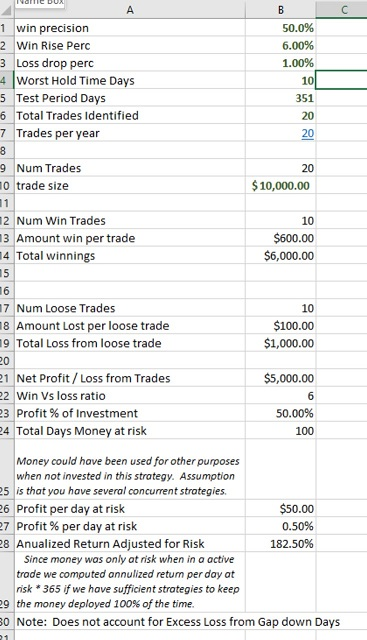
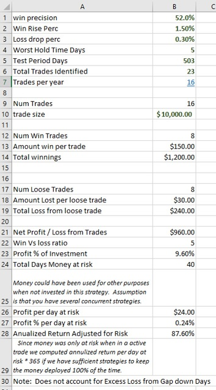

# ML Quantized classifier in GO#

A general purpose, high performance machine learning classifier.   

#### Basic Test results

| Prediction Type                          | Quantized Classifier | Quant  time ms |        Tensorflow CNN | TF time ms |
| ---------------------------------------- | -------------------: | -------------: | --------------------: | ---------: |
| Classify breast cancer                   |               94.81% |             60 |                94.81% |      7,080 |
| Predict death or survival of Titanic passengers |               82.00% |             80 |                77.53% |      5,520 |
| Predict Diabetes                         |               70.58% |             80 |                65.89% |      7,330 |
| Predict Liver disorder                   |                62.5% |             70 |                67.35% |      6,160 |
| Stock SPY predict 1% rise before 1% drop. class=1 (success) only | 65.9%  at 24% recall |            390 | 71.43%  at 13% recall |     59,000 |

> > * Tests measure Precision at 100% recall. Recall forced to 100% by choosing highest Prob Class from answer as the class chosen.
> > * Tensorflow n_epoch = 30, batch=55.   Tensorflow CUDA = GeForce GTX 960M.  QuantProb is only using system CPU and uses no optimizer.
> > * Run includes both train and test stage. Timing from cygwin time command
> > * All source and data to duplicate test is in repository

Please send me data sets you would like to add  to the test.

| [Stock Price Prediction tutorial](https://bitbucket.org/joexdobs/ml-classifier-gesture-recognition/wiki/stock-example/predict-future-stock-price-using-machine-learning.md) |      | [wiki](https://bitbucket.org/joexdobs/ml-classifier-gesture-recognition/wiki/Home) |
| ---------------------------------------- | ---- | ---------------------------------------- |
| **[Analyze Predictive value of Features in stock price prediction](https://bitbucket.org/joexdobs/ml-classifier-gesture-recognition/src/default/demo/stock/spy/1-up-1-dn/docs/stock-price-prediction-analyze-feature-value.md?at=Adding+By+Feature+and+By+Feature+Group+Analysis&fileviewer=file-view-default)** |      | [Tutorial Deep Learning for stock price prediction](tlearn/docs/stocks/deep-learning-for-stock-price-prediction.md) |
| [How can I use quantized classifier to make money?](https://bitbucket.org/joexdobs/ml-classifier-gesture-recognition/wiki/how-can-i-use-quantized-classifier-to-make-money.md) |      |                                          |
| **I Offer Consulting services see: http://BayesAnalytic.com/contact** |      |                                          |

### Quantized Classifier ###
>The Quantized classifier uses a clever grouping mechanism to identify similar groups of items for each feature.  This mechanism is very fast, yields good classification accurcy and delivers unique data discovery capabilities.  The design was  inspired by  KNN, Bayesian, K-Means, SVM and Ensemble techniques.  
>
>The key benefit is accuracy and recall that rivals [Deep learning Convolutional Neural Networks](https://www.tensorflow.org/tutorials/deep_cnn/) while providing faster training, faster classification and consuming less RAM.  It has no dependencies other than the GO compiler which makes deployment easy.   CNN is better for image classification while Quantized classifier is well suited for tasks where each feature contains a measurement that has the same meaning for all rows.
>
>The quantized optimizer provides the unique ability to identify features that are most important for accurate classification.  It can identify the best grouping for each feature. For example: It can determine that dividing age in two groups between 0..50, 51..100 are important for some predictions while a much finer breakdown is more important for other predictions.   It can identify features that negatively contribute to classification accuracy.    These findings can be surfaced to the user who can use them to help guide their research.
>
>The quantized optimizer can identify important data grouping such as determining that  bit 1,19,37 in a particular genome slice are critical inputs when predicting a condition such as risk of early cancer while bits 2,17,32 contribute negatively when identifying the same condition.     It can identify specific clusters of data values that drive prediction such as a Man purchasing a plane ticket with one other traveler it may be important to predict whether that user is likely to purchase a vacation package.  The optimizer could identify that ticket history is only important when they have purchased more than 3 tickets in the last 3 years  AND more than 2 tickets during the last 2 years AND more than 1 in the last 9 months AND none during the last 5 months.    This kind of data discovery can be valuable to help marketing people and domain experts formulate marketing campaigns.  
>
>####What is a Quantized Classifier####
>The easiest way to understand the quantized classier is to compare it to others.   It draws a notion of similarity from KNN.   It uses statistical base probability similar to Bayesian engines.    It uses a multi-feature assembly strategy similar to weighted ensembles.   The optimizer draws on techniques from randomized genetic algorithms.
>
>In [KNN](http://bayesanalytic.com/knn-and-ensemble-for-stock-price-prediction/) we find similar records for a given feature by finding  those with the most similar value compared to the same feature in the current record.   The classes identified for the set of similar records are used to classify the current reord.      This works but consumes  space and run-time.  It requires the unique values for all the training data to be retained in a form that makes finding the most similar records for each feature fast.      The  Quantized approach looks at the range of data and attempts to group data of similar values based on numeric ranges.   
>>If all records in the training data sets have a feature with a value between 0.0 to 1.0 then a 10 bucket (quanta) system would be divided into 10 groups based on range of values found in all training records.   Group1=0.0 to 0.1,  Group2= 0.1 to 0.2,  Group3= 0.2 to 0.3.  All records that have a value that maps to the same group would be considered similar.  Records with a value between 0.1 to 0.2 would be similar in Group2.     Each unique grouping bucket is considered a quanta.     Each feature for each row is analyzed and assigned a quanta.  The quanta for each feature are a discrete set and do not influence the quanta for other features.  
>>
>>The system keeps  statistics for each class found for each quanta.  We may have 100 total training records that map to the quanta 1 (0.0 to 0.1).   70 of these records are tagged as class 1 while 30 records are tagged as class  0.   This is used to compute a base probability.   During a future classification request  a record that has a value that is between 0.0 and 0.1 has a 70% probability of belonging to class 1 and a 30% probability of belonging to class 0. 
>>
>>This process is repeated across all features.  The set of base probabilities are combined using ensemble techniques to produce a probability by class for each row classified.   In the simple version all features have the same weight and the same number of quanta.  In the optimized version the system is free to change the weight and number of quanta for each feature.  
>
>Quantizing the data allows a small memory foot print to deliver fast training and fast classification without the need to keep all the training records in memory. Retaining only the statistics allows very large training sets with moderate memory use.   The trade off is loosing KNN's ability to adjust the number of closest neighbors considered at runtime without retraining.  Memory use is so much smaller than KNN that we can afford to keep multiple models with different quanta sizes loaded and updated simultaneously. 
>
>Choosing the number of max quanta is important for choosing the best prediction results.  The default of 10 works for many applications but we have found situations where 90 quanta works better and there are a few where 5 quanta work better.   In general a larger number of quanta delivers more precise results at reduced recall.  There are applications where reducing the number of quanta improved precision because it was able to reduce the influence of noisy training data.  
>
>> > * **The system automatically tries the to find a match for each feature using the most precise number of Quanta you allowed in the -maxBucket setting on the command line.   It will use less precise values working back to only 2 Quanta as needed.**
>
>Whenever using statistical techniques outliers in the data can yeild a negative impact on classification accuracy.  In a quantized engine outlier values affect results because quanta ID are computed based on the absolute range of training data.  This can cause values in the center of the distribution to be forced into a smaller number of quanta which reduces the discrimination the majority data that also tends to be closer to the center of the distribution.   The Quantized classifier handels this by computing an effective range for the values in each Quanta.   The effective range is determined by removing 1.5% of the training values from the low and high end and then computing the range between min and max for the remaining records.  We use a clever mechanism for outlier removal that avoids the need to sort the values because we wanted to handle training sets larger than physical memory.    The quanta are indexed in a sparse matrix so outlier values still get their own quanta and can participate in classification but the effective range mechanism prevents outliers from negatively affecting precision for the majority dataset. 
>


##Metadata##

* Version: 0.16
* License: [MIT](https://opensource.org/licenses/MIT) I reserve the right to change the license in the future but you will always be able to continue using the version you downloaded under the MIT version using the MIT license. 
* **We sell consulting services http://BayesAnalytic.com/contact**
* Dependencies: 

   - [GO Code](https://en.wikipedia.org/wiki/Go_(programming_language)) is cross platform and will run Linux.  This software was built using 
     version 1.7.3 windows/amd 64
   - Python code: Was tested with Python 3.5.2 64 bit
   - TensorFlow: Lots of crazy dependencies See: tlearn/tensflowReadme.docx 

## How to Use ##

* On my machine I have cygwin installed and added to PATH so I can use most linux commands from DOS shells.   You will notice that I use some linux commands like rm instead of the DOS equivalent.  You can edit the BAT to make them windows specific without cygwin.    We also have .sh files for most scripts to support linux users buy you may need to chmod +x to make them executable.


1 [**Install GO**](https://golang.org/doc/install)

2 **[setGoEvn.bat](setGOEnv.bat)**  [.sh](setGOEnv.sh) - will set the GOHOME directory to current working directory  in a command prompt.  This is required for the GO compiler to find the  source code.   *Tested on windows 10 but should be similar on linux if chmod is set to 777*.

3 **[makeGO.bat](makeGO.bat)**   [.sh](splitData.sh)- First install GO and ensure it has  been added to PATH.  Open a command line at  the base directory containing makeGO.bat and run it. It will build the executables based on GO that are needed to run  the tests. Tested on windows 10 but should be similar on linux.


  > ```
  > go build src/classifyFiles.go   
  >  
  >   Builds executable classifyFiles from GO source.
  >   This is done automatically by makeGO.bat but
  >   replicated here to show how to do it manually    
  >   
  > ```

4 **[splitData.bat](splitData.bat)** - Creates sub .train.csv and  test.csv files for the files used in the classifier tests. Uses splitCSVFile.exe which is built by makeGo.  Run this before  attempting to run the classifier to ensure proper data is present.

5 **classifyBeastCancer [.bat](classifyTestBreastCancer.bat)   [.sh](classifyTestBreastCancer.sh)**

  > > ```
  > > classifyFiles -train=data/breast-cancer-wisconsin.adj.data.train.csv -class=data/breast-cancer-wisconsin.adj.data.class.csv -numBuck=10 -WriteJSON=false -classOut=tmpout/breast-cancer.class.out.csv  -WriteFullCSV=true  -detToStdOut=true
  > > ```
  > >
  > > The classify request was triggered instead of the test because -class was used as the second set of input data rather than -test that normally specifies test input. 
  > >
  > > The main difference between the classify and Test is that classify ignores the value in the class column and generates a less complex file that contains less data.   It can also re-write a copy of the source CSV with the class replaced with the predicted class. 
  > >
  > > ##### Sample Classification Output
  > >
  > > Sample data in tmpout/breast-cancer.class.out.sum.csv.   This is the short version  of results that gives the caller just enough information to map the predicted class up with the original classification request.  There are also options to generate the original CSV with the class column updated to reflect the predictions.   


  > >     ndx,bestClass,bestProb
  > >     0,2,0.78951055
  > >     1,4,0.6948877
  > >     2,2,0.78734744
  > >     3,4,0.7989442
  > >     4,2,0.7599269
  > >     5,4,0.664731
  > >     6,4,0.46487543
  > >     7,2,0.5792924
  > >

>> 6  **ClassifyFiles**  This following is printed by the classify files when incorrect parameters are entered. 
>> ```
>>     -train=finame      file containing training data
>>                        optional when model input is specified
>>     -test=finame       file containing data to use to test model
>>                        file must exist when specified.
>>                        optional when -class is specified.
>>
>>      -class=finame      name of file containing data to classify
>>                         must exist is specified.   Optional when
>>                         -test is specified.  By convention class
>>                         is set to -1 in input class files but the
>>                         system doese not care.
>>
>>      -classout=finame   name of file to write classify results to
>>                         will be written in csv format.  If not
>>                         specified default name  will be name
>>                         specified by -testout with .csv
>>                         replaced with .out.csv.  By convention
>>                         all named output files should end with
>>                         .out.csv.   Note: Clasout is also used
>>                         to derive the name and path to save
>>                         the analysis file.  
>>
>>     -testout=finame    Write test output CSV file name to this file
>>                        instead of the default output file.   By convention
>>                        all output files should end with .out.csv
>>                        if not set will write data into same
>>                        directory as test input file with differnt
>>                        extensions to protect orginal data.
>>
>>     -maxBuck=10        Maximum Number of qanta buckets to use
>>                        larger numbers allow more precise matching
>>                        which can be helpful when lots of test data
>>                        is available but it also consumes more time
>>                        and RAM because the system builds multiple
>>                        quant count models to allow fast fallback
>>                        to less precise quanta if it fails to find
>>                        a match using the most precise quanta available.            
>>
>>      -writeJSON=true    if present then write results to JSON files
>>                         otherwise will only generate CSV.
>>
>>     -writeCSV=true     Will write output in CSV form which will
>>                        require multiple files in some instances
>>                        or supress some explanatory information
>>                        defaults to true if not specified.
>>
>>     -writeFullcsv=false Write the original CSV with all columns
>>                       the same except for the class column values
>>                       will be changed to the predicted class
>>                       defaults to false.
>>
>>     -writeDetails=true Write files containing detailed probability
>>                        by row in addition to the summary information
>>                        this shows the probability of each row belonging
>>                        to each class.
>>                        file extensions will be .det added to path
>>                        name.
>>
>>     -detToStdOut=false When true will print values saved in the generated
>>                       files to stdout as things are processed.  This consumes
>>                       considerable time so turn of except when debugging.
>>                       defaults to true.
>>                       
>>     -catColumns=      A comma delimited list of column names to be 
>>                       treated as categories or a list of unique 
>>                       strings instead of numeric values. With 
>>                       category columns each unique string gets
>>                       tracked as one unique quanta id.
>>                       
>>     -IgnoreColumns=   A comma delimited list of column names to be 
>>                       ignored.  They will still be copied to the 
>>                       detail CSV output but they will not be used
>>                       in any classificaiton activity. This kind of
>>                       column is normally used for documenation to
>>                       make integration easier.                      
>>
>>     -DoPreAnalyze      If true will pre-analyze data set attempting
>> 	                  to find number of buckets for each column
>> 					that maximizes a combination of precision and
>> 					recall.  Defaults to false
>> 					
>>     -AnalClassId       When specified it will analyze based on finding
>> 	                  best settings for the specified class otherwise
>> 					 will try to find best precision for the entire
>> 					 set of records.  Defaults to not set
>> 	
>>     -AnalSplitType     if 1 then split by pulling test records from
>> 	                  body of training data.  If 2 then pull test
>> 					 records from end of training data. Defaults
>> 					 to 1
>> 	
>>     -AnalSplitPort     The portion of training set to use as test data
>> 	                  defaults to 0.15 if not set.  When set to 100
>> 				     it will use entire training set as both test
>> 					 and train during the analysis phase.
>> 				
>>     -AnalAdjFeatWeight=true Adjust feature weights based on feature 
>>                       performance so more accurate features have more impact
>> 					on classification results.   true = do adjust
>> 					false = do not adjust.   Defaults to true.
>> 					
>> ```

* > #### Classification Examples
  >
  > **[classifyTestBreastCancer.bat](classifyTestBreastCancer.bat) [.sh](classifyTestBreastCancer.sh)** - Runs classifyFiles on breast cancer data set.   Look in tmpout for generated files.

* > **[classifyTestDiabetes.bat](classifyTestDiabetes.bat)**  [.sh](classifyTestDiabetes.sh) - Runs classifyFiles on diabetes data set. Look in tmpout for generated files.

* > **[classifyTestLiverDisorder.bat](classifyTestLiverDisorder.bat)**  [.sh](classifyTestLiverDisorder.sh)- Runs classifyFiles on Liver disorder data set.  Look in tmpout for generated files.

* > **[classifyTestTitanic.bat](classifyTestTitanic.bat)**  [.sh](classifyTestTitanic.sh) - Runs classifyFiles on Titanic survial data set.  Look in tmpout for generated files.
  >
  > **[classifyTestWine.bat](classifyTestWine.bat)** [.sh](classifyTestWine.sh) - runs classifyFiles on the Wine taste prediction data set. Look in tmpout for generated files.
  >
  > **classifyTestCredit.bat  .sh** - runs classifyFiles on the Credit score predicting those who were granted credit.     Demonstrates use of mixed Category (string) value features and Numeric features.  Also reloads previously saved analyzer data to improve score while reducing runtime.   
  >
  > ​
  >
  > #### Example of predicting stock price movement
  >
  > > See Also: [Stock Price Prediction tutorial](https://bitbucket.org/joexdobs/ml-classifier-gesture-recognition/wiki/stock-example/predict-future-stock-price-using-machine-learning.md)
  >
  > * **SPY Up 1% before Down 1%  [Feature Analysis Tutorial](demo/stock/spy/1-up-1-dn/docs/stock-price-prediction-analyze-feature-value.md) **  -  [Classify SPY](demo/stock/spy/1-up-1-dn/classifyTest.bat)   seeking a 1% gain in market price before market price drops by over 1%.   During the training period 33.7% of bars meet this goal. During the testing period 32% meet.   To be useful in a trading system it needs to deliver over 50% precision requiring a minimum of 18% lift.  The current system delivers 65.8% precision.   Uses simple look back slope angle of price change.  
  > * **classifyTestStockspy90 [bat](demo/stock/spy/6up1dn-mh10/classifyTestSPY.bat)   [sh](demo/stock/spy/6up1dn-mh10/classifyTestSPY.sh)** - Classify  SPY seeking a 6% rise from current bar before the price drops by more than 1% from current price.   Since the magnitude of win is 6X the size of loss we need  16.67% precision to be viable in a trading system.     During training period 4.8% of bars meet this goal.  During the test period 4.44% of bars meet the goal.  The classifier is delivering 83.3% precision at 33% recall which is a 78.9% lift.    This one is using a SMA(90) as the compare to compute an angle vector of price change to current bar.
  > * **classifyTestStockslv30  [bat](demo/stock/slv/1p5up0p3dn-mh5/classifyTestSLV.bat)   [sh](demo/stock/slv/1p5up0p3dn-mh5/classifyTestSLV.sh)**  - Classify SLV seeks a 1.5% market rise before the market drops 0.3%.    We need a precision of at least 20% to be viable as part of a trading system.     It is using slope angle of price change compared to price at a point in the past measured for 3, 6, 12, 20, 30, 60, 90 bars in the past.   The Classifier is delivering 50% precision at 2.67% recall which is more than double the precision needed to be viable in a trading system. 
  > * Classify Test CAT target 7.8% exit with profit taker before encountering stop loss at 1.2% with max hold time of 5 days.  [analyze](/demo/stock/cat/7p8up1p2dn-mh5/analyzeCAT.bat)  [classifyTest](/demo/stock/cat/7p8up1p2dn-mh5/classifyTestCAT.bat)
  > * 
  >
  > #### Analyze Relative Importance of Features
  >
  > >  See Also: [Explanation Analyze Predictive value of Features in stock price prediction](demo/stock/spy/1-up-1-dn/docs/stock-price-prediction-analyze-feature-value.md)
  >
  > * *analyzeDiabetes  [bat](analyzeDiabetes.bat)  [sh](analyzeDiabetes.sh)**  - Analyze relative importance of different features for the diabetes test data set.   Shows that Insulin, NumPregnancy and Skin Thick supply high predictive value.   Shows that Weight,  Diastolic and pedigree are relatively less important.  
  > * **analyzeLiverDisorder  [bat](analyzeLiverDisorder.bat)   [sh](analyzeLiverDisorder.sh)** -  Analyze relative important of different features for liver disorder classification.   Shows that for this data set alkpyhos, gammagt are very important predictive inputs while mcv and sgpt are unimportant and may contribute negatively to results.
  > * **SPY Up 1% before Down 1%  [Feature Analysis Tutorial](demo/stock/spy/1-up-1-dn/docs/stock-price-prediction-analyze-feature-value.md) **   [Classify SPY](demo/stock/spy/1-up-1-dn/classifyTest.bat) - Analyze relative importance of different features for predicting stock prices.   [See Also](https://bitbucket.org/joexdobs/ml-classifier-gesture-recognition/wiki/stock-example/stock-price-prediction-analyze-feature-value.md)  Shows that  column sl6, and sl12 are very important and the sl6 could actually deliver better precision and recall used alone than when used in conjuction with the other features.  It shows the sl60, sl30 and sl3 deliver such low predictive input that they are most likely reducing the net quality of predictions. 
  > * **analyzeTitanic  [bat](analyzeTitanic.bat)    [sh](analyzeTitanic.sh)** - 
  > * **analyzeCredit bat  .sh** - Analyzes the credit score data to predict those granted credit.  Demonstrates mixed category and numeric features.  Also saves the .analyze file to allow fast re-use.   The analyzer substantially improves performance for class 1 performance.  Also demonstrates generating the .model file that can be used for secondary processing in data discovery step.  
  >
  >

####For the Tensorflow tests###
* See [TensorFlow Demo][tlearn]
* [Install python](https://www.python.org/downloads/release/python-352/). We tested 3.5.2 but it should work with newer versions. Only needed if you want to run TensorFlow or Python samples we supplied.
* [Install TensorFlow](https://www.tensorflow.org/get_started/os_setup), [TFLearn](http://tflearn.org/installation/) and  run their basic tests to ensure they  run correctly.  This may also require installing CUDA depending on  whether you want to use the GPU version of TensorFlow.  TFLearn requires      Python we tested ours with python 3.5.2.   Not needed if you only want      to run our GO based classier engines. 


## Basic Contents ##
Not all files are listed here. The intent is to help you find those files that are most likley to be helpful. when learning the sysem.

* **[todo.md](docs/todo.md)** - list of actions and enhancements roughly
    prioritized top down.

### GO Based Classifier ###

* [src/qprob/classify.go](src/qprob/classify.go) Main Classifier data structures along with training logic.
* [src/qprob/classifyResult.go](src/qprob/classifyResult.go) - Performs the basic classify operations and includes data structures for the classify result. 
* [src/qprob/classifyAnal.go](src/qprob/classifyOptimizer.go) - Adds basic Analysis functions to the results such as providing statistics by class.   Also analyzes relative importance of various features.
* [src/qprob/classifyOptimizer.go](src/qprob/classifyOptimizer.go) - Implements the optimizer 
* [src/qutil/commandLineParser.go](src/qutil/commandLineParser.go) - Utility to parse command line into easy to access components.
* [src/classifyFiles.go](src/classifyFiles.go) Main file driver interface for classifier.  A good set of example code if you want to use the classifier library from GO source code. 
* [src/qprob/csvInfo.go](src/qprob/csvInfo.go)  Utility library to parse CSV files including finding min, max values,  determining which columns are valid numbers, etc. 
* [src/qprob/util.go](src/qprob/util.go) Utility library adding silly things that should have been built in like a Max that works type safe with int32 and split a string into array of float.
* [src/splitCSVFile.go](src/splitCSVFile.go) - Utility to split input CSV files into two separate files one for training and one for testing.

### Idea Test Sample Code ###
* Original Proof of theory samples
  - [Install python](https://www.python.org/downloads/release/python-352/). We  tested 3.5.2 but should work with newer versions.    Only needed if you want to run the Python samples we supplied.
  - **python [quant_filt.py](quant_filt.py)** - Runs test on gesture classification data.   Shows how quantized concept can be used to implement    splay like search trees.  It acts something like a decision    tree and something like a multi layer CNN.     The more quant buckets used the more precise.  This is an    alternative to the probability  model and can provide superior results in some   instances.  Machine learning Quantized filter classifier.  This system can provide  fast classification with moderate memory use and is easy to see how likely the match is to be accurate.
  - **python [quant_prob.py](quant_prob.py)** - Runs a test on  gesture classification data demonstrates quantized probability theory in smallest possible piece of python code.  A more   complete version is implemented in classify.go Machine learning Quantized probability classifier. Not quite as precise under some conditions and quant_filt.py but it can cope with greater amounts of training noise while still delivering good results with moderate amounts of training data.  


## Contribution guidelines ##

* **[todo.md](docs/todo.md)** - list of actions and enhancements roughly prioritized top down.
>*  See [Text classification overview](docs/text-classification/overview-classification.md) 
* **[design-notes.md](docs/design-notes.md)** Engineering Design Notes and design thoughts.
* **[genomic-notes.md](docs/genomic-notes.md)**
* **[go-notes.md](docs/go-notes.md)** Notes and helpful links about GO that I recorded while working on the classifer.go
* [**Background**](https://bitbucket.org/joexdobs/ml-classifier-gesture-recognition/wiki/background.md)   Includes documentation about a skewed population with overlapping values and how we are going to approach it.  It also introduced the Quantized Filter concept and how it helps deal with the skewed population problem
* Writing tests
* Code review
* Other guidelines

## Who do I talk to? ##

* Repo owner Joseph Ellsworth CTO of Bayes Analytic.  Algorithms Research,  Search, Machine Learning,  Enterprise Architecture,  High Performance, High Availability distributed architecture. 
* **I sell consulting services for Search, Machine Learning, High performance High availability distriuted architecture.  http://BayesAnalytic.com/contact**


> This work actually includes two classifiers.  The first one is the Quantized Probability classifier.  The other is a Quantized Filter classifier.  Both can classify but they tend to be optimized for different use cases.    I will add additional documenation for the Quantized Filter as it matures but wanted to finish the optimizer and web interface for the Quantized probability engine first.

### DATA FILES

- **data/data-sources.txt** - Explains sources for the included data files some data files are not included and will have to be donwloaded from those sources if the usage license was unclear or restrictive.
- **data/train/gest_train_ratio2.csv** - Input training data used for these tests.  We need thousands additional training samples feel free to volunteer after your read overview.pdf in this repository.

### Why another Classifier

The short answer is the existing systems did not meet my needs for a high performance,  accurate and portable classifier that could be deployed with minimal dependencies at low cost.   They also did not deliver the level of optimization I wanted.  They were not built with the idea of using the classifier output to help discover important data features. 

After trying several different ML systems I found each of them had one or more of these deficiencies:  

> A) They ran too slow for training.  

> B) They could not cope with incremental data updates.  

> C) They ran too slow during classification.  

> D) They consumed too much memory.  

> E) They could not handle adequately large data sets at reasonable cost.  
>
> F) They failed to deliver adequate precision, adequate recall or both.    

I tried many libraries including Weka, Scikit-learn, Azure ML, Theano, [orange](http://orange.biolab.si/),  Etc.  I tested a wide variety of classifiers such as Bayesian, Decision Trees, SVM, KNN, CNN.    Of the libraries I tried Weka seemed to offer the best performance but it struggled to cope with the data volumes I was using.      

TensorFlow Deep Learning is the newest buzz term so I am evaluating it's performance concurrent with building and testing the Quantized classifier.    I will probably add a spark test as well. 

#### Tensor Flow Comparison

> One goal of this project was to compare the classification and machine performance of Quantized Classifier against Tensorflow when ran against the same data.    This repository includes TensorFlow Deep Learning implementation of classifiers. [readme](tlearn)  

> [CNNClassify.py](tlearn/CNNClassify.py) Provides Python code that will read our [Machine learning CSV Files](data) and produce classification output without changing the code.  It provides a nice way to think about generalized use of Tensorflow.
> > For large data sets the Tensorflow demo speed improved substantially.   This seems to indicate that the CUDA version of Tensorflow we are using has a high startup overhead but runs well one loaded.    With the 500 Mb cifar dataset the Tensorflow CNN was 15%  slower than quantized classier with n_epoch=8.   When n_epoch was increased to 150 to maximize precision of CNN classification it was  over 10X slower.  The CNN substantially outperformed in the MNIST image classification with 91% versus 52% precision at 100% recall.   Even though it is slower the CNN is still better for image classification. 

#### Quantized Classifier not designed for image classification 
> Quantized classifier is designed specifically for data sets where the value of a feature column describes the same measurement for all rows.    For pictures subject moves around within the frame.  This movement essentially changes the meaning of the feature column.   The simplistic approach to feeding image data into the Quantized classifier is to flatten the data into a single long array of int.    This means the quantized classifier is measuring the pixel per pixel comparison of pixel brightness.  This works in some conditions but breaks down when lighting conditions change or the subject moves in the frame.   There are image preprocessing techniques that [extract feature data from images](https://en.wikipedia.org/wiki/Feature_extraction) such as [feature detection](https://en.wikipedia.org/wiki/Feature_detection) and [blob extraction](https://en.wikipedia.org/wiki/Connected-component_labeling).  The Quantized engine would be able to process the extracted features better since they can be scaled to a common scale. Some [Neural Nets](http://rodrigob.github.io/are_we_there_yet/build/classification_datasets_results.html) have better ability to cope with raw image data when the subject moves or is variable sized but image pre-processing seems like a better approach for many image classification.    There are a variety of ways to improve the ML Classifier performance on images using pre-processors such as [Edge Detection](https://en.wikipedia.org/wiki/Edge_detection), [Corner Detection](https://en.wikipedia.org/wiki/Corner_detection), [Ridge Detection](https://en.wikipedia.org/wiki/Ridge_detection), [Despeckle](https://books.google.com/books?id=EVoNLGlAbnkC&pg=PA1&lpg=PA1&dq=despeckle+meaning&source=bl&ots=02HMQnlVDU&sig=lFSTXzy2s6_vMAeI6uYWIm7EuJA&hl=en&sa=X&ved=0ahUKEwinpeeOi9TRAhVV8mMKHd8FAPAQ6AEIZjAO#v=onepage&q=despeckle%20meaning&f=false), [Binarization](http://felixniklas.com/imageprocessing/binarization) and [layout analysis](https://en.wikipedia.org/wiki/Document_layout_analysis) on images but we choose to focus on classification jobs where the meaning of the measurement for a given column remains constant.   

### ASP (American Sign Language) Gesture classifier

> The Quantized Classifier started as a classifier designed to classify Static Gestures for VR with the idea we may be able to produce a useful tool for classifying  ASL using VR input devices.  That is still a primary focus but the core algorithms can be more broadly applied.
>
> See **[Overview.pdf](docs/gest-rec-overview.pdf)** in this repository for conceptual overview of the approach when using this kind of classifier for gesture recognition.
>
> This repository includes code written to test ideas for static gesture recognition. 
>
> It also includes samples of the classifiers in python that cope well with smaller training data sets and demonstrate using  the Quantized classifier approach.  They also handle massive training data sets with minimal memory. 

### See Also [bibliography.md](docs/bibliography.md)

