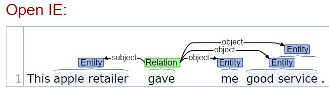

# Conceptual approach to Text Classification

NOTE:  This document is only intended to capture my thoughts so I have them available to review when implementing a Text classification module for the Quantized Classifier.   This document is not intended for other engineers. 

## Classifying simple text 

This approach is designed for small fragments of text like Twitter where grammar is minimal and often misused.   As such we will treat each word as a discrete input that can be statistically modeled.   Examples would be:

* I love the apple ipod 
* I hate apple retailers 
* This apple retailer gave me good service.

### Less Naive bag of words

This approach uses a less naive approach as a bag of words.   Where the occurrence of each word in a given document is counted.   You can think of each word as a feature where the count is the feature value for that word.    We analyze all words in the training set and consider each unique word a feature.          

When classifying the process is reversed so the set of words or topics in the document are broken apart into individual features.  Their feature index is retrieved and then the probability for membership in each class is extracted just as the normal classify request.    The only real difference is we bypass the step of creating one big row for each piece of text which would be wasteful of system resources.    This approach will be modeled as a virtual row so it can be used in other contexts.  

The underlying premise is that over a given training set a given word or phrase will be less important or more important for classification accuracy.  The words that are important will vary depending on the classification type.     So classifying sentiment the words "good" and "hate" would be important but when classifying by product category they would be worthless. 

My approach to figuring out which words are important uses the Quantized Classifier optimizer which essentially varies the weight (importance) of different features attempting to find a combination of features that yield the best prediction accuracy when coerced to 100% recall or essentially being forced to take it's best guess on every document in the test set.     One of the unique features of the optimizer is to help minimize over learning the optimizer slightly favors turnining features all the way off if they contribute negatively to the prediction accuracy.   This means if the word "the" has no meaningful impact it would ultimately be turned off.  In this sense the system can learn the effective stop words.  

When paired with topic extraction (mentioned below) we have a choice of adding the extracted topics to the words to our virtual row or using only the virtual topics.    The advantage of adding them is the optimizer can determine whether the words or topics provide greater predictive value.  The advantage of only using the extracted topic  is that it provides fewer individual unique features which means the optimizer can find what is important faster.    The optimizer is a semi random guided genetic algorithm so the time it takes to find a optimal configuration is a function of how many things it has to try per feature times the number of features it is analyzing. 

### Domain specific word uses 

The basic premise is that given words in domain specific contexts will have a neutral or highly polarized meaning.   For example in the examples above is classifying for sentiment then word "apple" was actually neutral while "good", "hate", "love" are highly polarized.   But when classifying text by company the word "apple" would be critical.    

### Mapping to Features

The most direct way of mapping words to features for training would be to create one feature column for every active word in the training data set.   If there are 25,000 unique words then each row would be created as one row with 25,000 columns and only the words that actually have a word in them would contain a count while all others would be empty or contain a sentinel value such as "?" to indicate to not process.  The problem with this is that the trainer essentially walks across all features which would be a waste of CPU and memory resources. 

Since most documents only include a sub set of words their data row would logically be sparse array with a count filled in for each word that occured in the current document.  

To support this kind of data we will introduce the notion of  a "Sparse Row"  In this context we will process the data by building a index of all values in this instance it would be an index so each unique word gets an integer index that uniquely describes that word.   That integer index is treated as a feature index.     

In process we tokenize the array,  Remove stop words and nonsense punctuation then ieterate over the set of words looking up the index for each word.  Then call the trainFeature or classifyFeature with the  FeatureId, count value and class.    

We currently model features as an array which makes it fast to ieterate and fast to index into and luckily GO has built in functionality to make extending arrays painless and relatively performant. 

An alternate way of thinking about this to leverage our Bucket Id concept where a unique bucket is created for each quantized group of values.  The Bucket ID are already treated as a sparse matrix which makes them easy to add new buckets but they are slower to index into that features.   We use the same approach of creating a unique topic ID for each unqique word or phrase and then use that topic ID as the bucket Id.    This would still allow us to track multiple classes per token but it would remove the ability to use the count of occurences for that token.   


### Extending to Proximity

> There are some interesting implications from word proximity especially when using [NLP parsers like openie](http://nlp.stanford.edu/software/openie.html) .  This this instance we can quite often identity the primary noun in a text fragement.  Other word distance from that primary noun can have an impact on their value for classification.
>
> Both of the Stanford  [Basic parser](http://nlp.stanford.edu:8080/parser/index.jsp)  and their  [Parser with openie](http://corenlp.run/) struggled with the following phrase  "The water heater apple plumbing installed worked great"  but the basic parser did find interesting groupings words under compound and xcomp.    Here is an excerpt:
>
> >     ```
> >     det(plumbing-5, The-1)
> >     compound(plumbing-5, water-2)
> >     compound(plumbing-5, heater-3)
> >     compound(plumbing-5, apple-4)
> >     nsubj(worked-7, plumbing-5)
> >     acl(plumbing-5, installed-6)
> >     root(ROOT-0, worked-7)
> >     xcomp(worked-7, great-8)
> >     ```
>
> The  numbers are the relative position in the sentance.   "compound(plumbing-5, apple-4)"  means apple occured as word 4 and plumbing occured as word 5.     The parser failed to identify "Apple Plumbing"  or "water heater" as substantive topics which leads some suspicion to its usefulness but  if we  took this in a relatively simple approach we would order the words it grouped in document order and then use a value as the number of words separating the pairs.  This would give us "water plumbing" = 3,  "heater plumbing" = 2,  "apple plumbing"=1,  "plumbing installed"=1, "worked great"=1.
>
> It would be interesting to try this approach since it is pretty standard from NLP parsers and see how well it does compared to the topical dictionary approach below. 
>
> #### Adding topical Dictionary 
>
> I would also like to use a lexical dictionary with basic synonyms.   For example if my dictionary includes a topic "install water heater"  and my synonyms map "installed" to "install"  Then writing a search for all a phrase that contains all the words in my text would yield "install water heater" but it could also find "water heater install"  and the topic "water heater"   
>
> A less sophisticated lookup may also work.   In that instance we would search for phrases starting with "install" that is boosted by the number of the other words from the phrase they also contain.  We would run the prefix search for every word in the input text.   In this instance if the topic dictionary includes  "install water heater" and "water heater" and "plumbing"  the the  "Install water heater" would get the greatest score since it matched 3 words in the input phrase.    "water heater" would get the next greatest score since it matched 2 words and  "pluming" would receive the lowest score matching only 1 word.   A slight variation of this could search for any phrase that contains the first first token so if the phrase was  "water heater install" when we are processing the token "install" it would still be found even though the word matched was not the first token.  This would not be needed in this context because "water" would have matched but depending on exact match for first token would be less reliable.   If we ties then the score should be boosted for the number of consecutive terms that match in sequence so those with the closest exact phrase match win.
>
> #### Larger document proximity
>
> In other contexts if reviewing scientific papers some of the most important text for classification appears in the overview that occurs at the first of the paper and the summary wrap up that occurs near the end of the text.   If we were to divide such a paper into 10 chunks represening % through the document where that text occured then value could be used instead of occurence count.  
>
> It would be interesting to implement both the word count and proximity position as values for a given word.  Supporting this kind of value modification is one reason I favor the feature per word or feature per topic approach rather than modeling them into a single feature using multiple buckets were we no longer have the ability to use these value modifiers. 
>
> 

### Extending to IDF

IDF is essentially a model that assert the more often a word occurs in the document set the less important it is for matching any given document to a unique class.        For example the word "the" is so common that it should have little or no value when trying to classify a given document. 

**Traditional IDF**: One way to manage this is when we create the features to model each word we track a count of total number of times that word is used.   Then when we compute a probability of class membership we divide that probability by the number of occurences for that word it would reduce it's value in the match set compared to less frequently used words.      

An alternative approach would be to allow the optimizer to handle this.   If a given world is not contributing to classification accuracy then the optimizer should automatically reduce the weight of that feature to 0 which would turn that phrase off.   The optimizer approach will work but it could be slow to reach a optimal configuration due to the large number of words in the system. 

I think it is worth supporting both approaches by adding a applyIDF option flag.  This would require that we add a count by feature where we currently only track count at the number of rows but that would be a fairly small change.  


### Stop Word Removal

> Like other approaches we would have a certain set of stop words that would be removed from the  parsed result prior to training or classificaiton.  We have to be cautious with this because not may be a stop word but it would be important in a classification context. 


### Improved results with topic extraction

> In the example above a more sophisticated parser able to identify  "apple retailers"  and "good service" as discrete topics it would work even better.    This example from [Stanfords online NLP parser](http://corenlp.run/) correctly identified "good service" and "apple retailer" as topics using the [Open IE annotation](http://nlp.stanford.edu/software/openie.html).   I suspect that building on that will provide  improved text classification results compared to mapping "good" and "service" as speparate terms. 


## Using Search history to Augment results

In most business context where I have search string history I would actually use the search strings to identify topics and then extract topic matches based on the search strings.    

For example if I have many millions of searches of which  many were "water heater" I can deduce that water heater a topic of interest to users.     Once that has been identified then other less common but still significant terms such as "install water heater" can be mapped as sub topics.    

If My search history also contains  click through history where the click to points have been categories this can be used to build a richer data set so we could track "water heater" to three primary topics shuch as "home appliance", "plumbers",  "hvac"


## Disclaimer ##

I suspect that superior results could be used extracting topics from the text using a LDD based algorithm  and or a NLP parser that would allow us to associate adjustment words with effective nounes.     When classifying twitter messages grammar is minimal and miss leading so under this context this approach could excel while longer business text and email would be better served with a pre-processor.     


# Not Prioritized But interesting links I at least looked at

* [Intro to Automatic Keyphrase extraction](http://bdewilde.github.io/blog/2014/09/23/intro-to-automatic-keyphrase-extraction/)  Well worth the read.  Some good python samples that could be ported to other languages.
* http://www.hlt.utdallas.edu/~saidul/acl14.pdf
* [Automatic Keyphrase Extraction A Survey of the State of the Art](http://www.hlt.utdallas.edu/~saidul/acl14.pdf)  12 pages Kazi Saidul Hasan and Vincent Ng Human Language Technology Research Institute University of Texas at Dallas
  Richardson, TX 75083-0688
* [Wiki on automatic Summarization](https://en.wikipedia.org/wiki/Automatic_summarization) Very high level. 
* [A Survey on Automatic Text Summarization](https://www.cs.cmu.edu/~afm/Home_files/Das_Martins_survey_summarization.pdf) Dipanjan Das Andr´e F.T. Martins
  Language Technologies Institute Carnegie Mellon University November 21, 2007
* [Survey of Keyword Extraction Techniques](http://www.cs.unm.edu/~pdevineni/papers/Lott.pdf). 11 pages.  cs.unm.edu December 4, 2012
* [Automatic Creation of Literature Abstracts](http://courses.ischool.berkeley.edu/i256/f06/papers/luhn58.pdf)  Focuses on Luhn method that is supposed ot be easy to implement
* [An Algorithm for One-page Summarization of a Long Text Based on Thematic Hierarchy Detection](http://www.aclweb.org/anthology/P00-1039.pdf)  Yoshio Nakao Fujitsu Laboratories Ltd. Kamikodanaka 4-1-1, Nakahara-ku, Kawasaki, Japan, 211-8588 
* [Automatic Multi-document Summarization Based on New Sentence Similarity Measures](http://net.pku.edu.cn/~hle/pubs/pricai12_automatic.pdf) 6 pages based on LDA algorithm.   Wenpeng Yin, Yulong Pei, and Lian’en Huang Shenzhen Key Lab for Cloud Computing Technology and Applications Peking University Shenzhen Graduate School Shenzhen, Guangdong 518055, P.R. China
* [Automatic Text Summarization using a Machine Learning Approach](https://www.cs.kent.ac.uk/people/staff/aaf/pub_papers.dir/SBIA-2002-Joel.pdf)  Joel Larocca Neto Pontifical Catholic University of Parana (PUCPR) Rua Imaculada Conceicao, 1155
* [Summarization by Latent Dirichlet Allocation: Superior Sentence Extraction through Topic Modeling](http://kentonmurray.com/thesis/thesis.pdf) 81 pages Thesis  Kenton W. Murray April 17, 2009
* [Python keyword extraction using RAKE](https://www.airpair.com/nlp/keyword-extraction-tutorial)  also mentions Maui the java version
* [Stanford online NLP parser with Open ID support](http://corenlp.run/)
* [Stanford openIE explained](http://nlp.stanford.edu/software/openie.html)
* [Stanford online NLP parser](http://nlp.stanford.edu:8080/parser/index.jsp)
* [Stanford Core NLP command line github](http://stanfordnlp.github.io/CoreNLP/cmdline.html)
* [30 API for text summarization](http://blog.mashape.com/list-of-30-summarizer-apis-libraries-and-software/)
* [Similarity Measure based on LDA for Automatic Summarization](http://www.sciencedirect.com/science/article/pii/S1877705812004298)  Science direct   Latent Dirichlet Allocation LMMR and LSD algorithm 
* [Gensim automatic text summarization using Iron Python](https://rare-technologies.com/text-summarization-with-gensim/)  Uses the [TextRank algorithm](https://web.eecs.umich.edu/~mihalcea/papers/mihalcea.emnlp04.pdf) and the [BM25 ranking](https://raw.githubusercontent.com/summanlp/docs/master/articulo/articulo-en.pdf)
* [Automatic Text Summarizer in Python](https://github.com/miso-belica/sumy).  GitHub  uses   [Luhn Heuristic](http://ieeexplore.ieee.org/xpl/articleDetails.jsp?arnumber=5392672),  [LSA (Latent Semantic Analysis)](http://scholar.google.com/citations?user=0fTuW_YAAAAJ&hl=en), [LexRank](http://tangra.si.umich.edu/~radev/lexrank/lexrank.pdf), [TextRank](https://en.wikipedia.org/wiki/Automatic_summarization#Unsupervised_approaches:_TextRank_and_LexRank), [SumBasic](http://www.cis.upenn.edu/~nenkova/papers/ipm.pdf), [KL-Sum](http://www.aclweb.org/anthology/N09-1041)
* [Text Summarization with NLTK in python](http://glowingpython.blogspot.com/2014/09/text-summarization-with-nltk.html)
* [Node JS module that summarizes text using a naive summarization algorithm](https://github.com/jbrooksuk/node-summary) github [Nice simple algorithm](https://github.com/jbrooksuk/node-summary/blob/master/lib/summary.js)
* [An Efficient Way to Extract the Main Topics from a Sentence](https://thetokenizer.com/2013/05/09/efficient-way-to-extract-the-main-topics-of-a-sentence/) By Shlomi Babluki 2013  [python source github](https://gist.github.com/shlomibabluki/5539628)  [Uses context fee grammar](https://en.wikipedia.org/wiki/Context-free_grammar)  Very small python module seems to work well.
* [Text Mining Online Keyword extraction using Ipython and Rake](http://textminingonline.com/getting-started-with-keyword-extraction)
* [go-freeling](https://github.com/advancedlogic/go-freeling) - github - natural language procssing in GO 
* [go-rake](https://github.com/wolfgangmeyers/go-rake) gitup A golang implementation of the Rapid Automatic Keyword Extraction (RAKE) algorithm MIT license   [another Go Rake on github seems more complete at least from docs ](https://github.com/Obaied/RAKE.Go) 
* [Go Machine learning & NLP libraries](https://biosphere.cc/software-engineering/go-machine-learning-nlp-libraries/)

